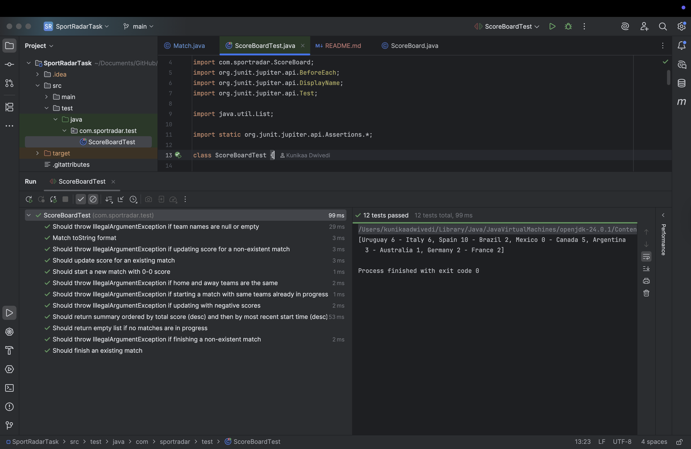

# Live Football World Cup Scoreboard

This project implements a simple in-memory live scoreboard for the Football World Cup. It's designed as a standalone Java library, following the core principles of **Test-Driven Development (TDD)**, **Object-Oriented Design**, **Clean Code**, and **SOLID** principles.

---

## Features

The scoreboard library supports the following operations:

- **Start a new match**: Initializes a new match between two teams with a default score of 0 - 0.
- **Update score**: Allows updating the scores for an ongoing match.
- **Finish a match**: Removes a completed match from the scoreboard.
- **Get a summary of matches**: Provides a sorted list of all ongoing matches.

### Sorting Criteria

1. By total score (sum of home and away scores) in **descending** order.
2. For matches with the same total score, by their **most recently started** time in descending order.

---

## Project Structure

- **`pom.xml`**: Maven project configuration file.
- **`src/main/java/com/sportradar/`**: Contains the core library classes:
    - **`Match.java`**: Represents a single football match, holding team names, scores, and start time. Responsible for managing its own score updates.
    - **`ScoreBoard.java`**: The main scoreboard class that manages the collection of `Match` objects and provides the public API for scoreboard operations.
- **`src/test/java/com/sportradar/test/ScoreboardTest/`**: Contains JUnit 5 tests for the scoreboard functionality.

---

## Developer Notes and Assumptions

### 1. In-Memory Store

- Uses `java.util.concurrent.CopyOnWriteArrayList` to store match data.
- Offers thread safety for reads and avoids `ConcurrentModificationException` during concurrent modifications.
- No explicit locking or complex concurrent data structures needed.

### 2. Match Uniqueness

- A match is uniquely identified by the combination of **home team and away team names** (case-insensitive).
- Starting a new match with teams already involved throws an `IllegalArgumentException`.
- Home and away team names must be **different**.

### 3. Score Updates

- Scores are **absolute** (not incremental).
- **Negative scores are not allowed**; attempting to set them throws an `IllegalArgumentException`.

### 4. Time Precision for Sorting

- `LocalDateTime.now()` is used to capture the match start time.
- While it supports nanosecond precision, system clock resolution is typically **milliseconds**.
- Unit tests use `Thread.sleep(10)` between `startMatch` calls to ensure distinct start times.
- In real systems, this would naturally be handled via external timestamps.

### 5. SOLID Principles

- **Single Responsibility Principle (SRP)**:
    - `Match` manages its own state and updates.
    - `ScoreBoard` manages the match collection and operations.

- **Dependency Inversion Principle (DIP)**:
    - Currently, `ScoreBoard` uses `CopyOnWriteArrayList` directly.
    - In scalable applications, an abstraction (e.g., `MatchRepository`) would decouple storage from logic.

---

Inheritance/Polymorphism: These are not explicitly used in this simple design. The problem domain doesn't necessitate a complex inheritance hierarchy. If, for example, different types of matches (e.g., "friendly match," "tournament match") with different behaviors were required, inheritance might become relevant.

---

ScreenShot of all test passes

---

This implementation balances **simplicity**, **robustness**, and **best practices**, making it suitable as a lightweight and maintainable Java library.

Note: My Prime Github account is https://github.com/DeepeshSengarIO which I am not able to access right now as I am travelling right now. So this assignment is done through my secondary account. Have given it a lot of effort, read it thoroughly :) 